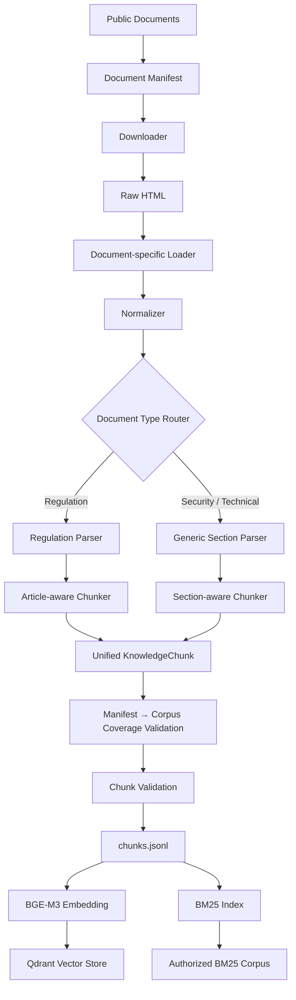
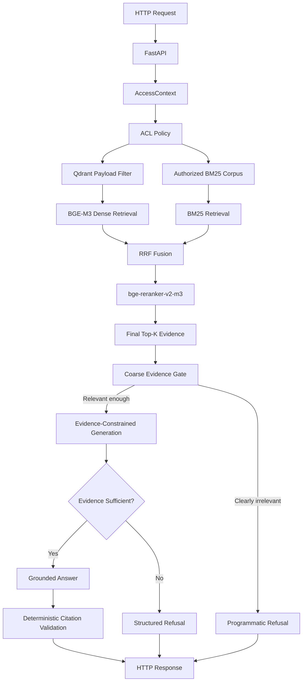
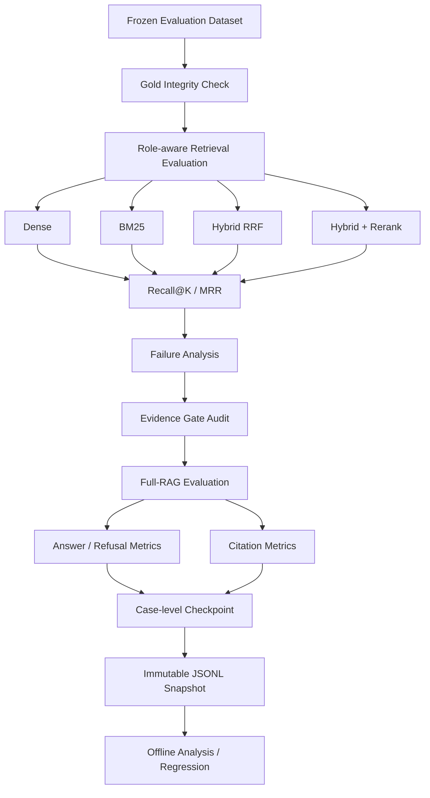
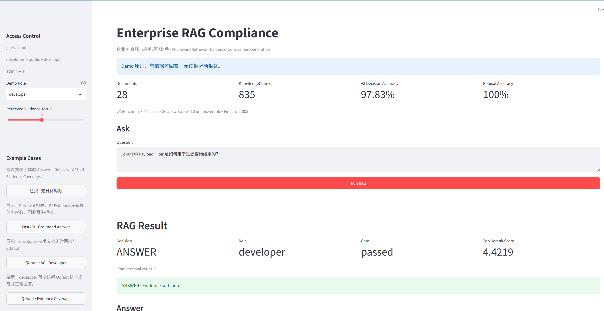
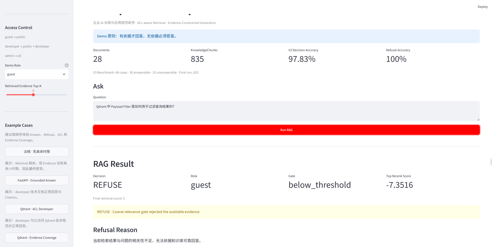
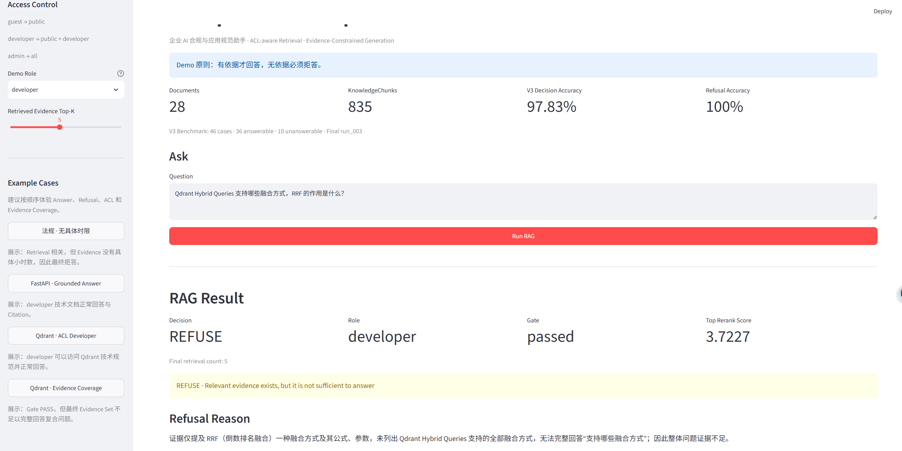

# Enterprise RAG Compliance

> 企业 AI 合规与应用规范助手

面向企业内部 **RAG / Agent 研发人员与管理员** 的垂直知识库问答系统。

项目不是构建“万能知识库”，而是围绕：

- 生成式人工智能合规；
- 深度合成与算法治理；
- 个人信息与数据安全；
- OWASP LLM 应用安全；
- FastAPI / Qdrant 企业内部技术规范模拟；

实现一套：

```text
有依据才回答
无依据必须拒答
权限隔离
混合检索
Rerank
可追溯 Citation
离线评测
Failure Analysis
Regression Evaluation
```

的可解释 RAG 系统。

> 当前项目定位为单人可完成的校招作品级企业 RAG 骨架，用于展示完整的系统设计、评测方法与工程取舍，不代表生产环境准确率、可靠性保证或 SLA。

---

# 1. Final Results at a Glance

## 1.1 Knowledge Base

| Item | Result |
|---|---:|
| Documents | **28** |
| KnowledgeChunks | **835** |
| Qdrant Points | **835** |
| Manifest → Corpus Coverage | **PASS** |
| Chunk Validation | **PASS** |

---

## 1.2 Final Retrieval Evaluation · V3

V3：

```text
46 total cases
36 answerable
10 unanswerable
```

| Method | Recall@1 | Recall@3 | Recall@5 | Recall@10 | MRR@10 |
|---|---:|---:|---:|---:|---:|
| Dense | 0.8472 | 0.9722 | **1.0000** | **1.0000** | 0.9130 |
| BM25 | 0.5139 | 0.6528 | 0.7083 | 0.7778 | 0.6051 |
| Hybrid RRF | 0.7639 | 0.9028 | 0.9444 | **1.0000** | 0.8509 |
| Hybrid + Rerank | 0.8472 | **0.9861** | **0.9861** | **1.0000** | **0.9259** |

---

## 1.3 Final Full-RAG Evaluation · V3 run_003

| Metric | Result |
|---|---:|
| Cases | 46 |
| TP | 35 |
| TN | 10 |
| FP | **0** |
| FN | 1 |
| Overall Decision Accuracy | **97.83%** |
| Answerable Accuracy | **97.22%** |
| Refusal Accuracy | **100.00%** |
| Hard Negative Refusal Accuracy | **100.00%** |
| OOD Refusal Accuracy | **100.00%** |

对于本项目：

```text
无依据必须拒答
```

的目标，当前最重要的结果之一是：

```text
10 / 10 Unanswerable
全部正确拒答

False Positive = 0
```

> 以上结果来自当前冻结的 V3 Benchmark，不代表生产环境准确率或 SLA。

---

## 1.4 Citation Evaluation

| Metric | All-case | Strict |
|---|---:|---:|
| Citation Precision | 0.8629 | 0.8944 |
| Citation Recall | 0.9690 | **0.9917** |
| Citation Hit Rate | **1.0000** | **1.0000** |

当前 Citation 的主要问题是：

```text
Over-Citation
```

而不是完全没有引用到正确证据。

---

# 2. Project Highlights

这个项目最终留下了几个比“用了哪些框架”更重要的实验结论。

### Hybrid Retrieval ≠ Automatically Better

```text
Strong Dense
+
Weak Cross-lingual BM25
↓
Equal-weight RRF
↓
可能降低正确 Gold 的排名
```

V3：

```text
Dense MRR       = 0.9130
Hybrid RRF MRR  = 0.8509
```

说明 Hybrid 必须经过真实 Corpus Evaluation，而不能因为架构更复杂就默认更好。

---

### Rerank Can Repair Fusion Noise

V3：

```text
Hybrid RRF MRR        = 0.8509
Hybrid + Rerank MRR   = 0.9259
```

Reranker 能修复多起 RRF Rank Degradation。

但：

```text
Single-Passage Relevance
≠
Evidence-Set Coverage
```

R044 表明 Reranker 把单个 Passage 排得更相关，并不天然保证复合问题需要的所有 Evidence 都进入最终 Top-K。

---

### ACL Must Be Applied Before Retrieval

```text
Role
↓
Authorized Candidate Space
↓
Dense / BM25
↓
Fusion
↓
Rerank
```

而不是：

```text
全库检索
↓
最后过滤 Unauthorized Chunk
```

R042 / R045 使用同一个 Query、不同 Role，形成了端到端 ACL 对照实验。

---

### Retrieval Relevance ≠ Answerability

```text
Evidence 与问题高度相关
```

不代表：

```text
Evidence 已经包含回答问题需要的全部事实
```

因此当前系统采用：

```text
Coarse Evidence Gate
+
Evidence-Constrained Generation
```

而不是一个 rerank score threshold 直接决定 Answer / Refuse。

---

### Evaluation Infrastructure Also Needs Testing

开发过程中实际遇到：

```text
Dataset 中有 role
≠
Evaluation Harness 真正执行 role
```

以及：

```text
LLM 被要求输出 JSON
≠
每次都满足 Structured Output Contract
```

最终分别通过：

```text
Role Propagation Regression Test
Strict Parser
Bounded Structured-output Retry
Checkpoint / Resume
```

解决。

---

# 3. Why This Project

这个项目重点解决的不是：

```text
“如何调用一个大模型 API”
```

而是一个企业 RAG 系统真正需要面对的问题：

```text
文档如何可靠进入知识库？
        ↓
如何召回正确证据？
        ↓
不同用户能看到哪些证据？
        ↓
Hybrid / Rerank 是否真的有效？
        ↓
证据相关是否等于能够回答？
        ↓
无依据时如何拒答？
        ↓
Citation 如何防止模型伪造？
        ↓
系统效果如何量化？
        ↓
出现 Failure 后如何定位？
        ↓
改动后如何验证没有 Regression？
```

因此本项目实现：

```text
Structure-aware Ingestion
Manifest → Corpus Coverage Validation
Unified KnowledgeChunk
BGE-M3 Dense Retrieval
BM25 Retrieval
RRF Hybrid Fusion
bge-reranker-v2-m3
Pre-Retrieval ACL
Coarse Evidence Gate
Evidence-Constrained Generation
Structured Refusal
Deterministic Citation Validation
Role-aware Evaluation
Retrieval / Answer / Citation Evaluation
Failure Analysis
Checkpoint / Resume
Frozen Regression Benchmark
```

---

# 4. Tech Stack

```text
Python 3.11
FastAPI
LangChain ecosystem
Qdrant
BGE-M3
bge-reranker-v2-m3
BM25
Jieba
SiliconFlow OpenAI-compatible API
Streamlit
pytest
Docker
```

本地开发环境：

```text
Windows
32 GB RAM
RTX 4060 Laptop GPU
```

Embedding：

```text
BAAI/bge-m3
1024 dimensions
```

Reranker：

```text
BAAI/bge-reranker-v2-m3
```

LLM：

```text
deepseek-ai/DeepSeek-V4-Flash
```

通过：

```text
SiliconFlow OpenAI-compatible API
```

调用。

---

# 5. System Architecture

当前系统由三条核心链路组成：

```text
Offline Ingestion
→ 异构文档转换为统一 KnowledgeChunk

Online RAG
→ ACL-aware Retrieval
→ Rerank
→ Evidence Gate
→ Grounded Generation

Evaluation
→ Frozen Dataset
→ Retrieval / Answer / Citation
→ Failure Analysis
```

---

## 5.1 Offline Ingestion



---

## 5.2 Online Query Pipeline



---

## 5.3 Evaluation Pipeline



---

# 6. Demo Preview

Streamlit Demo 只作为 Client，通过 HTTP 调用 FastAPI Backend：

```text
Streamlit
↓ HTTP
FastAPI
↓
ACL-aware Retrieval
↓
RRF
↓
Rerank
↓
Evidence Gate
↓
Evidence-Constrained Generation
```

Streamlit 不直接：

```text
加载 BGE-M3
加载 Reranker
连接 Qdrant
调用 QueryService
读取 LLM API Key
```

Demo 会展示：

```text
Role
Decision
Gate Result
Top Rerank Score
Citation
Retrieved Evidence
Dense / BM25 Rank
RRF / Rerank Score
```

---

## 6.1 Grounded Answer

Developer 查询 Qdrant Payload Filter：



```text
role     = developer
decision = ANSWER
gate     = passed
```

授权角色能够检索：

```text
developer
```

级别的 Qdrant 技术规范，并生成带 Citation 的 Grounded Answer。

---

## 6.2 ACL Same-Query Refusal

保持 Query 完全不变，仅将角色切换为：

```text
guest
```

Qdrant `developer` Chunk 会在 Candidate Generation 前被排除：



```text
role        = guest
decision    = REFUSE
gate        = below_threshold
top score   = -7.3516
```

这验证：

> ACL 发生在 Retrieval 前，而不是生成后过滤答案。

---

## 6.3 Relevant Evidence ≠ Sufficient Evidence

R044：

```text
Qdrant Hybrid Queries 支持哪些融合方式，
RRF 的作用是什么？
```



系统结果：

```text
role     = developer
gate     = passed
decision = REFUSE
```

Retriever 找到了高度相关的 RRF Evidence，但最终 Evidence Set 没有完整覆盖复合问题的两个部分。

因此：

> **Single-Passage Relevance ≠ Evidence-Set Coverage**

系统选择拒答，而不是依赖模型外部知识补齐。

---

# 7. Knowledge Base

当前 Corpus：

```text
28 documents
835 KnowledgeChunks
```

覆盖三类主要知识：

```text
中国法规 / 规范
+
OWASP LLM Top 10
+
FastAPI / Qdrant Technical Documentation
```

部分法规包括：

```text
《生成式人工智能服务管理暂行办法》

《互联网信息服务深度合成管理规定》

《中华人民共和国个人信息保护法》

《中华人民共和国数据安全法》

《网络数据安全管理条例》

《互联网信息服务算法推荐管理规定》

《人工智能生成合成内容标识办法》

《中华人民共和国网络安全法（2025修正版）》
```

安全规范：

```text
OWASP Top 10 for LLM Applications
LLM01 – LLM10
```

技术文档包括：

```text
FastAPI Dependencies
FastAPI Lifespan

Qdrant Points
Qdrant Vectors
Qdrant Payload
Qdrant Collections
Qdrant Indexing
Qdrant Search
Qdrant Filtering
Qdrant Hybrid Queries
```

> FastAPI / Qdrant 官方文档本身均为公开资料。项目中将部分技术文档设置为 `developer` Access Level，仅用于模拟企业内部技术规范 ACL，不表示这些官方资料存在真实访问限制。

---

# 8. Ingestion Design

## 8.1 Regulation

法规不使用简单固定长度切分。

当前流程：

```text
Regulation
↓
Chapter
↓
Article
↓
KnowledgeChunk
```

基本原则：

```text
一个法规条文
≈
一个语义 Chunk
```

法规天然具有明确条款边界。

如果将：

```text
第七条
```

从中间任意截断，会破坏：

```text
语义完整性
Citation 可读性
Gold Annotation
```

因此法规采用：

```text
Article-aware Structure-aware Chunking
```

对于没有显式：

```text
第一章
第二章
```

但直接出现：

```text
第一条
第二条
...
```

的法规，也支持隐式 Chapter，避免文档因缺少 Chapter Heading 而生成 0 Chunk。

---

## 8.2 Security / Technical Documentation

OWASP、FastAPI、Qdrant 不具有法规式：

```text
第几章
第几条
```

结构。

因此采用：

```text
HTML
↓
Heading Hierarchy
↓
GenericSection
↓
section_title
section_path
↓
Section-aware Chunker
↓
KnowledgeChunk
```

Section 较长时：

```text
优先按自然段聚合
```

只有单个段落本身超长时才进行硬切分。

目标不是让所有 Chunk 长度完全一致，而是：

```text
优先保留结构边界
优先保留语义完整性
```

---

# 9. Unified KnowledgeChunk

所有数据源最终统一进入：

```text
KnowledgeChunk
```

核心字段：

```text
chunk_id
document_id
title
document_type
language
version

chapter_number
chapter_title
article_number

section_title
section_path

content
retrieval_text

source_url
access_level

chunk_index
content_hash
```

其中：

```text
content
```

保存真实正文。

```text
retrieval_text
```

用于 Retrieval，会加入有助于检索的：

```text
Document Title
Chapter / Article
Section Path
Content
```

不会把：

```text
source_url
access_level
```

等与语义相关性无关的信息强行加入 Retrieval Text。

---

# 10. Corpus Validation

项目区分：

```text
Chunk 是否合法？
```

与：

```text
Manifest 中启用的文档
是否真的进入 Corpus？
```

开发过程中曾真实出现：

```text
enabled document
↓
下载成功
↓
Normalization 成功
↓
Parser 生成 0 Article
↓
最终生成 0 Chunk
```

但已有：

```text
Chunk Validation
```

仍然能够 PASS。

原因是它只检查：

```text
已经生成出的 Chunk 是否合法
```

不会发现：

```text
某篇 enabled document
根本没有进入 Corpus
```

因此增加：

```text
Manifest → Corpus Coverage Validation
```

当前：

```text
28 enabled documents
28 Corpus documents

Coverage = PASS
```

因此得到一个重要工程结论：

> **Chunk Validity ≠ Manifest-to-Corpus Completeness**

---

# 11. Dense Retrieval

Dense：

```text
Query
↓
BGE-M3
↓
1024-d Dense Vector
↓
Qdrant ACL Filter
↓
Dense Search
```

当前 Corpus 同时包含：

```text
中文法规
英文 OWASP
英文 FastAPI
英文 Qdrant
```

很多 Evaluation Query 使用中文。

实验中 BGE-M3 能完成：

```text
中文 Query
↓
英文 Evidence
```

的跨语言语义匹配。

因此：

> BGE-M3 Dense 是当前中英混合 Corpus 上最稳定的基础 Retriever。

---

# 12. BM25 Retrieval

BM25：

```text
Query
↓
Jieba
↓
BM25
↓
Authorized Candidate Space
```

优点：

```text
延迟极低
词法命中清晰
适合补充精确关键词
```

但当前存在大量：

```text
中文 Query
→ 英文 Evidence
```

例如：

```text
最小权限
```

与：

```text
least privilege
```

在普通 lexical retrieval 中没有天然对应关系。

因此出现：

```text
Cross-lingual Lexical Mismatch
```

BM25 仍作为 lexical complement 保留，但不作为主 Retriever。

---

# 13. Hybrid Retrieval

当前 Hybrid：

```text
Dense Top20
+
BM25 Top20
↓
RRF
↓
Hybrid Top20
```

RRF：

```text
score(d) = Σ 1 / (60 + rank(d))
```

当前没有为了 Evaluation Dataset 人工加入：

```text
Dense / BM25 Weight
Score Normalization
特殊 Query Rule
```

实验发现：

> **Hybrid Retrieval 并不天然优于 Dense。**

RRF 知道：

```text
Candidate 在每个 Retriever 中排第几
```

但不知道：

```text
某个 Retriever 当前 Query 上是否可靠
```

因此：

```text
Strong Dense
+
Weak Cross-lingual BM25
↓
Equal-weight RRF
↓
Weak branch may contaminate fusion
```

---

# 14. Rerank

RRF 后使用：

```text
BAAI/bge-reranker-v2-m3
```

Pipeline：

```text
Dense Top20
+
BM25 Top20
↓
RRF
↓
Hybrid Top20
↓
Reranker
↓
Final Top5
```

V3：

```text
Hybrid RRF MRR        = 0.8509
Hybrid + Rerank MRR   = 0.9259
```

说明 Reranker 能明显修复 Fusion Noise。

但：

```text
Rerank
≠
单调提升
```

尤其 R044 表明：

```text
单个 Passage 更相关
```

不等于：

```text
复合问题所需 Evidence Set 更完整
```

因此：

> Reranker 优化 Query-Passage Relevance，但不天然保证 Evidence-Set Coverage。

---

# 15. ACL Design

当前角色：

```text
guest
developer
admin
```

权限：

```text
guest
→ public

developer
→ public + developer

admin
→ public + developer + admin
```

核心原则：

> **ACL 必须在 Retrieval Candidate Generation 前执行。**

正确链路：

```text
Role
↓
Allowed Access Levels
↓
Qdrant Payload Filter
+
Authorized BM25 Corpus
↓
Retrieval
↓
Fusion
↓
Rerank
```

而不是：

```text
全库 Retrieval
↓
Rerank
↓
最后删除 Unauthorized Chunk
```

因为 Unauthorized Evidence 即使最终被删除，只要它先参与：

```text
Top-K Competition
RRF
Rerank
```

就已经污染合法结果排序。

---

## 15.1 Same Query, Different Role

V3：

```text
R042
R045
```

使用完全相同 Query：

```text
Qdrant 中 Payload Filter
是如何用于过滤查询结果的？
```

Developer：

```text
role = developer
↓
Qdrant technical chunks 可进入 Candidate Space
↓
Gate PASS
↓
Answer
```

Guest：

```text
role = guest
↓
Qdrant developer chunks 在 Retrieval 前被过滤
↓
只能检索 public candidates
↓
Gate REJECT
↓
Refuse
```

这证明：

> ACL 当前真实作用于 Retrieval Candidate Space，而不是最终 Response 的字符串过滤。

> 当前 API 中 `role` 仍然只是 Demo Input。生产环境应由可信 SSO / JWT / IAM 生成 AccessContext。

---

# 16. Retrieval Relevance ≠ Answerability

这是项目中最重要的实验结论之一。

例如：

```text
某法规规定发现违法内容后
必须在几小时内处理？
```

Retriever 可以找回：

```text
违法内容
及时处理
整改
报告
```

高度相关条款。

但 Evidence 中没有：

```text
具体小时数
```

因此：

```text
Evidence Relevant
```

不能推出：

```text
Evidence Sufficient
```

系统没有采用：

```text
rerank_score > threshold
=> answerable
```

而是：

```text
Rerank
↓
Coarse Evidence Gate
↓
Evidence-Constrained Generation
↓
Final Answerability
```

---

# 17. Coarse Evidence Gate

当前 Gate：

```text
min_top_score = -3.0
```

职责不是判断最终 Answerability，而是：

```text
低成本过滤明显 Out-of-Domain
或 ACL 后无相关 Evidence 的 Query
```

V3 Gate Audit：

```text
Answerable positives : 36
Gate False Negative  : 0
```

但 Answerable / Unanswerable 的 rerank score 明显重叠：

```text
Lowest positive Top1 : -2.0859
Highest negative Top1: 4.8008
```

因此：

> **Rerank Score 衡量 Relevance，而不是 Answerability。**

---

# 18. Evidence-Constrained Generation

Generation 必须：

```text
只能使用 Evidence 中明确出现的信息
不能使用模型外部知识补事实
不能猜数字、期限、金额、比例
不能把模糊描述变成精确事实
Evidence 不足必须拒答
Citation 只能引用真实 Evidence ID
```

回答结构：

```json
{
  "answerable": true,
  "answer": "回答文本",
  "reason": "证据为何足够",
  "citations": ["E1"]
}
```

拒答结构：

```json
{
  "answerable": false,
  "answer": null,
  "reason": "证据不足的原因",
  "citations": []
}
```

---

# 19. Strict Structured Output

LLM Output 不被程序默认信任。

Parser 会严格检查：

```text
JSON 是否合法
answerable 是否为 bool
answer 是否满足语义约束
reason 是否为非空字符串
citations 是否为数组
Evidence ID 是否真实存在
```

LLM 偶发违反 Contract 时：

```text
Generation
↓
Strict Parser
├─ PASS
│
└─ FAIL
    ↓
一次 Structured Output Retry
    ↓
Strict Parser
```

当前：

```text
max_parse_retries = 1
```

Retry 只处理：

```text
结构化输出协议错误
```

不会因为模型正常：

```text
Refuse
```

而强迫其重新回答。

---

# 20. Citation Design

LLM 只能返回：

```text
E1
E2
E3
```

这些内部 Evidence ID。

程序再确定性映射：

```text
Evidence ID
↓
EvidenceItem
↓
KnowledgeChunk
↓
chunk_id
title
article / section
source_url
```

模型不能自行编造：

```text
chunk_id
法规条款
URL
来源
```

因此 Citation Metadata 不依赖 LLM 自由生成。

---

# 21. Minimal Sufficient Evidence

Citation 目标不是：

```text
越多越安全
```

也不是：

```text
越少越好
```

而是：

```text
Minimal Sufficient Evidence Set
```

原则：

```text
只引用实际支持最终陈述的 Evidence

主题相关
≠
必须引用

同一个事实已有充分证据
→ 不重复堆 Citation

多个独立事实由不同证据支撑
→ 保留多个必要 Citation
```

当前仍观察到一定：

```text
Over-Citation
```

因此 Citation Selection 仍是一个明确 limitation。

---

# 22. Evaluation Design

当前 Evaluation 不只看：

```text
最终答案是否看起来正确
```

而是分别评估：

```text
Manifest Coverage
Chunk Validation
Gold Integrity
Role-aware Retrieval
Dense / BM25 / Hybrid / Rerank
Latency
Evidence Gate
Answer / Refusal
Citation
Regression
```

Dataset：

```text
V1
→ Frozen Seed Regression Benchmark

V2
→ Intermediate Capability Benchmark

V3
→ Final Capability Benchmark
```

完整实验过程见：

```text
docs/evaluation.md
```

---

# 23. Final Retrieval Evaluation · V3

V3：

```text
46 total cases
36 answerable
10 unanswerable
```

Retrieval Metrics 只统计 Answerable Query。

| Method | Recall@1 | Recall@3 | Recall@5 | Recall@10 | MRR@10 |
|---|---:|---:|---:|---:|---:|
| Dense | 0.8472 | 0.9722 | 1.0000 | 1.0000 | 0.9130 |
| BM25 | 0.5139 | 0.6528 | 0.7083 | 0.7778 | 0.6051 |
| Hybrid RRF | 0.7639 | 0.9028 | 0.9444 | 1.0000 | 0.8509 |
| Hybrid + Rerank | 0.8472 | 0.9861 | 0.9861 | 1.0000 | 0.9259 |

主要观察：

```text
Dense
→ 最稳定的基础召回

BM25
→ 跨语言场景明显较弱

Hybrid RRF
→ 不一定优于 Dense

Rerank
→ 能修复大量 Fusion Noise
→ 但不是单调提升
```

---

# 24. Retrieval Latency

正式 Latency 使用：

```text
Query-level Interleaved Benchmark
```

减少：

```text
GPU Warm-State
Method Order Bias
```

实验条件：

```text
Queries        : 20
Rounds         : 5
Samples/method : 100
Warmup         : 2
GPU            : RTX 4060 Laptop
```

| Method | Mean | P50 | P95 |
|---|---:|---:|---:|
| BM25 | 0.39 ms | 0.32 ms | 0.52 ms |
| Dense | 53.57 ms | 52.20 ms | 75.44 ms |
| Hybrid RRF | 56.54 ms | 54.71 ms | 77.51 ms |
| Hybrid + Rerank | 452.33 ms | 455.68 ms | 503.99 ms |

关系：

```text
BM25
<
Dense
≈
Hybrid RRF
<<<<
Hybrid + Rerank
```

因此：

> Reranker 是否值得始终开启，需要结合 Quality × Latency Evaluation，而不是只看排序指标。

---

# 25. Final Full-RAG Evaluation · V3 run_003

最终有效 Full-RAG Benchmark：

```text
Cases        : 46
Answerable   : 36
Unanswerable : 10
```

| Metric | Result |
|---|---:|
| TP | 35 |
| TN | 10 |
| FP | 0 |
| FN | 1 |
| Overall Decision Accuracy | **97.83%** |
| Answerable Accuracy | **97.22%** |
| Refusal Accuracy | **100.00%** |
| Hard Negative Refusal Accuracy | **100.00%** |
| OOD Refusal Accuracy | **100.00%** |

关键结果：

```text
10 / 10 Unanswerable
全部正确拒答

False Positive = 0
```

> 结果只代表当前冻结 V3 Benchmark，不代表生产环境准确率或 SLA。

---

# 26. Citation Evaluation · V3

All-case：

```text
Precision : 0.8629
Recall    : 0.9690
Hit Rate  : 1.0000
```

Strict Citation：

```text
Precision : 0.8944
Recall    : 0.9917
Hit Rate  : 1.0000
```

主要 Failure Pattern：

```text
正确核心证据
+
额外 supporting evidence
```

因此当前问题更偏向：

```text
Over-Citation
```

而不是完全引用错误。

---

# 27. R044 Failure Case

最终唯一 Answerable FN：

```text
R044
```

Query：

```text
Qdrant Hybrid Queries 支持哪些融合方式，
RRF 的作用是什么？
```

Gate：

```text
PASS
```

说明最终候选高度相关。

但 Top-K 更集中于：

```text
RRF 定义
RRF 公式
RRF 作用
```

没有完整覆盖：

```text
支持哪些融合方式
+
RRF 的作用
```

两部分。

因此系统最终：

```text
Refuse
```

而不是调用模型外部知识补齐。

这形成：

> **Single-Passage Relevance ≠ Evidence-Set Coverage**

当前没有为了把：

```text
35 / 36
```

调成：

```text
36 / 36
```

而修改冻结 V3 Gold、RRF、TopK、Reranker 或 Prompt。

---

# 28. Evaluation Infrastructure Failures

V3 Full-RAG 曾经历三次实验。

## run_001

```text
INVALID
```

原因：

```text
Evaluation Runner
错误地把所有 Case
统一按 guest 执行
```

Dataset 虽然保存：

```text
role
```

但 Harness 没有真正使用：

```text
case.role
```

修复后增加：

```text
guest case     → guest
developer case → developer
```

Regression Test。

---

## run_002

```text
ABORTED
```

原因：

```text
R032 structured output
reason 字段违反 Parser Contract
```

这里属于：

```text
Output Contract Failure
```

而不是：

```text
Business Refusal
```

因此没有把它伪装成：

```text
answerable = false
```

修复：

```text
Strict Parser
+
Bounded Structured-output Retry
```

---

## run_003

```text
VALID FINAL
```

包括：

```text
Role-aware Evaluation
Strict Structured Output
Bounded Retry
Case-level Checkpoint
Resume Safety Validation
Final Snapshot
```

---

# 29. Evaluation Checkpoint / Resume

Full-RAG Evaluation 会真实调用外部 LLM。

原始实现：

```text
46 Cases 全完成
↓
才保存结果
```

意味着中途失败时，前面已经完成的昂贵推理无法恢复。

当前改为：

```text
每完成一个 Case
↓
立即保存 Partial Snapshot
```

中断后：

```powershell
python scripts/run_answer_eval.py `
    --dataset v3 `
    --run-id <RUN_ID> `
    --resume
```

Resume 会验证 Partial Snapshot 是否为：

```text
当前冻结 Dataset 的连续前缀
```

防止：

```text
乱序
缺洞
Dataset 漂移
重复 LLM 调用
```

全部完成后：

```text
Partial Snapshot
↓
Completeness Validation
↓
Final Snapshot
↓
删除 Partial
```

---

# 30. API

当前接口：

```text
GET  /health
GET  /ready
POST /api/v1/retrieve
POST /api/v1/ask
```

`/retrieve`：

```text
ACL-aware Retrieval
+
Fusion
+
Rerank
```

不调用 LLM。

`/ask`：

```text
Retrieval
↓
Rerank
↓
Evidence Gate
↓
Generation / Refusal
↓
Citation
```

API Response Schema 同时兼容：

```text
Regulation
→ article_number = "第X条"

Technical Documentation
→ article_number = null
```

该 Contract 已通过专门的 HTTP Regression Test 锁定，避免技术文档再次因为 Response Schema nullability 不一致导致 HTTP 500。

---

# 31. Example QA Showcase

这里选取四类 Case 展示系统能力边界。

---

## 31.1 Grounded Answer

Query：

```text
FastAPI 挂载的子应用会自动执行主应用的 lifespan 事件吗？
```

Role：

```text
developer
```

实际链路：

```text
Developer ACL
↓
FastAPI Lifespan Evidence
↓
Gate PASS
↓
Evidence Sufficient
↓
Answer
```

实际验证结果：

```text
不会。

FastAPI 的 lifespan 事件只会为主应用执行，
不会在挂载的 Sub Applications（Mounts）中自动执行。
```

对应 Citation：

```text
fastapi_lifespan__lifespan_events_sub_applications__0001
```

该 Case 展示：

```text
有直接 Evidence
→ Grounded Answer
→ Citation 可追溯
```

---

## 31.2 Unsupported Fact → Refusal

Query：

```text
生成式人工智能服务管理暂行办法规定，
发现违法内容后必须在几小时内处理？
```

Retriever 可以找到：

```text
违法内容
及时处理
整改
报告
```

相关 Evidence。

但是没有：

```text
明确小时数
```

因此系统不能猜：

```text
24 小时
48 小时
72 小时
```

而应明确说明当前证据没有提供具体小时数。

该 Case 展示：

> **有相关 Evidence ≠ 有足够 Evidence。**

---

## 31.3 Same Query, Different Role

Query：

```text
Qdrant 中 Payload Filter
是如何用于过滤查询结果的？
```

### Developer

```text
role = developer
↓
Qdrant technical chunks 可访问
↓
Relevant Evidence Retrieved
↓
Gate PASS
↓
Answer
```

### Guest

```text
role = guest
↓
Qdrant developer chunks
在 Candidate Generation 前被过滤
↓
无法获得对应技术 Evidence
↓
Gate REJECT
↓
Refuse
```

因此：

```text
Same Query
+
Different Role
↓
Different Candidate Space
↓
Different Valid Response
```

该 Case 展示：

> ACL 发生在 Retrieval 前，而不是生成后过滤答案。

---

## 31.4 Relevant But Incomplete Evidence

Query：

```text
Qdrant Hybrid Queries 支持哪些融合方式，
RRF 的作用是什么？
```

Role：

```text
developer
```

系统找到了大量：

```text
RRF
Hybrid Search
Fusion
```

相关 Evidence。

Gate：

```text
PASS
```

但最终 Evidence 只足以充分解释：

```text
RRF 的作用
```

不足以完整回答：

```text
支持哪些融合方式
```

因此系统选择：

```text
Refuse
```

而不是让模型利用外部知识补齐。

该 Case 展示：

```text
Single-Passage Relevance
≠
Evidence-Set Coverage
```

也是当前系统明确保留的 Failure，而不是为了 Benchmark 100% 对测试集调参。

---

# 32. Reproduction

## 32.1 Install

要求：

```text
Python >= 3.11,<3.12
```

安装核心 Backend：

```powershell
python -m pip install --upgrade pip
python -m pip install -e .
```

安装开发 / 测试依赖：

```powershell
python -m pip install -e ".[dev]"
```

安装 Streamlit Demo：

```powershell
python -m pip install -e ".[demo]"
```

开发 + Demo：

```powershell
python -m pip install -e ".[dev,demo]"
```

---

## 32.2 Environment Variables

根据：

```text
.env.example
```

创建本地：

```text
.env
```

至少配置：

```text
SILICONFLOW_API_KEY
```

可选：

```text
LLM_MODEL
```

真实 API Key 不应提交到 Git。

---

## 32.3 Start Qdrant

```powershell
docker compose up -d
```

检查：

```powershell
docker compose ps
```

Dashboard：

```text
http://localhost:6333/dashboard
```

---

## 32.4 Build Corpus

```powershell
python scripts/build_chunks.py
```

当前预期：

```text
Documents = 28
Chunks    = 835

Manifest → Corpus Coverage = PASS
Chunk Validation           = PASS
```

---

## 32.5 Build Vector Index

```powershell
python scripts/build_vector_index.py
```

当前预期：

```text
Embedding Dimension = 1024
Qdrant Point Count  = 835
```

---

## 32.6 Retrieval Evaluation V1

```powershell
python scripts/run_retrieval_eval.py --dataset v1
```

用途：

```text
Frozen Regression Benchmark
```

---

## 32.7 Retrieval Evaluation V2

```powershell
python scripts/run_retrieval_eval.py --dataset v2
```

用途：

```text
Intermediate Capability Benchmark
```

---

## 32.8 Retrieval Evaluation V3

```powershell
python scripts/run_retrieval_eval.py --dataset v3
```

用途：

```text
Final Retrieval Capability Benchmark
```

---

## 32.9 Evidence Gate Audit

```powershell
python scripts/audit_evidence_gate_scores.py
```

只执行：

```text
Retrieval
Rerank
Gate
```

不调用 SiliconFlow LLM。

---

## 32.10 Full-RAG Evaluation

使用新的 Run ID：

```powershell
python scripts/run_answer_eval.py `
    --dataset v3 `
    --run-id <NEW_RUN_ID>
```

如果中途中断：

```powershell
python scripts/run_answer_eval.py `
    --dataset v3 `
    --run-id <SAME_RUN_ID> `
    --resume
```

> 当前 `run_003` 已作为 V3 Final Snapshot 冻结，不应覆盖。

---

## 32.11 Retrieval Latency Benchmark

```powershell
python scripts/run_interleaved_retrieval_latency_benchmark.py
```

---

## 32.12 Run Tests

```powershell
pytest -v
```

---

# 33. Run Backend and Demo

需要两个终端。

## 33.1 Start FastAPI

```powershell
uvicorn enterprise_rag.api.app:create_app --factory
```

Swagger：

```text
http://127.0.0.1:8000/docs
```

接口：

```text
GET /health
GET /ready
POST /api/v1/retrieve
POST /api/v1/ask
```

Heavy Runtime 在：

```text
FastAPI Lifespan
```

中初始化一次。

不会每个 Request 都重新加载：

```text
BGE-M3
Reranker
BM25
```

---

## 33.2 Start Streamlit Demo

另开终端：

```powershell
streamlit run demo/app.py
```

默认访问：

```text
http://localhost:8501
```

Demo Client 通过 HTTP 调用 FastAPI：

```text
Streamlit
↓ HTTP
FastAPI
↓
RAG Runtime
```

而不会直接初始化第二套模型服务。

---

# 34. Repository Structure

```text
enterprise-rag-compliance1/
│
├── data/
│   ├── manifest/
│   │   └── documents.yaml
│   │
│   ├── raw/
│   │
│   ├── processed/
│   │
│   └── eval/
│       ├── retrieval_eval_v1.jsonl
│       ├── retrieval_eval_v2.jsonl
│       ├── retrieval_eval_v3.jsonl
│       └── results/
│           ├── answer_eval_v3_run_001.jsonl
│           └── answer_eval_v3_run_003.jsonl
│
├── demo/
│   ├── api_client.py
│   └── app.py
│
├── docs/
│   ├── evaluation.md
│   └── images/
│       ├── demo_qdrant_developer_answer.png
│       ├── demo_qdrant_guest_acl_refusal.png
│       └── demo_evidence_coverage_refusal.png
│
├── scripts/
│   ├── build_chunks.py
│   ├── build_vector_index.py
│   ├── download_enabled_documents.py
│   ├── run_retrieval_eval.py
│   ├── run_answer_eval.py
│   ├── audit_evidence_gate_scores.py
│   ├── run_interleaved_retrieval_latency_benchmark.py
│   └── ...
│
├── src/
│   └── enterprise_rag/
│       ├── acl/
│       ├── api/
│       ├── embeddings/
│       ├── evaluation/
│       ├── evidence/
│       ├── generation/
│       ├── ingestion/
│       ├── llm/
│       ├── reranking/
│       ├── retrieval/
│       ├── runtime/
│       ├── service/
│       └── vectorstore/
│
├── tests/
│
├── docker-compose.yml
├── pyproject.toml
├── .env.example
├── .gitignore
└── README.md
```

> `data/raw/` 与 `data/processed/` 中的大量本地产物默认不提交 Git，可通过 Manifest 与 Ingestion Pipeline 重建。

---

# 35. Key Design Conclusions

## Dense

> BGE-M3 Dense 是当前中英混合 Corpus 上最稳定的基础 Retriever，并具有较好的中文 Query → 英文 Evidence 跨语言召回能力。

---

## Hybrid

> Hybrid 不天然优于 Dense。Equal-weight RRF 虽然避免了直接比较 Dense / BM25 不同 Score Scale，但不会判断某个 Retriever 当前是否可靠；弱 BM25 分支可能污染 Fusion Ranking。

---

## Rerank

> bge-reranker-v2-m3 能修复多起 RRF Rank Degradation，V3 MRR 从 0.8509 提升到 0.9259，但计算成本明显增加，而且 Single-Passage Relevance 提升不保证 Evidence-Set Coverage。

---

## ACL

> ACL 必须在 Candidate Generation 前执行，而不是 Retrieval 后过滤。相同 Query 在 developer / guest 下进入不同 Candidate Space，从检索源头实现权限隔离。

---

## Evidence Gate

> Rerank Relevance 与 Answerability 是不同任务。Coarse Gate 适合过滤明显无关 Query，但不能单独承担 Evidence Sufficiency 判断。

---

## Citation

> Retrieval Gold 与 Citation Gold 必须解耦。Citation 的目标不是越多越安全，而是找到能够完整支撑最终答案的 Minimal Sufficient Evidence Set。

---

## Evaluation

> RAG Evaluation 不能只看一个 Accuracy。本项目分别评估 Corpus Coverage、Chunk Validity、Retrieval、ACL、Gate、Answer / Refusal 和 Citation，并通过冻结 Dataset 与 Snapshot 保存 Regression Evidence。

---

# 36. Engineering Lessons

项目开发过程中实际遇到：

```text
Chunk Validation
≠
Manifest → Corpus Coverage
```

```text
Dataset 中保存 role
≠
Evaluation Harness 真正执行 role
```

```text
LLM 被要求输出 JSON
≠
每次都满足 JSON Contract
```

```text
有 Final Snapshot
≠
中途失败时已有昂贵推理结果不会丢
```

```text
Retrieval Relevance
≠
Answerability
```

```text
Single-Passage Relevance
≠
Evidence-Set Coverage
```

```text
Retrieval Gold
≠
Citation Gold
```

```text
Domain Model 允许 None
≠
API Response Schema 可以随意收窄为 str
```

这些 Failure 最终通过：

```text
Metric / Real Demo
↓
Failure Case
↓
Root Cause
↓
Code / Architecture Change
↓
Regression Test
↓
Re-evaluation
```

形成闭环。

---

# 37. Current Limitations

当前项目定位是：

```text
单人可完成
校招作品级
企业 RAG 系统骨架
```

而不是大规模生产平台。

主要限制：

1. 当前 Corpus 为 28 篇、835 Chunk，仍远小于真实企业知识库；
2. Final V3 只有 46 条 Evaluation Case；
3. 尚未建立更大规模独立 Development Set + Held-out Test Set；
4. Citation 仍存在一定 Over-Citation；
5. R044 暴露了多证据问题中的 Evidence-Set Coverage 问题；
6. 尚未建立独立 Answer Correctness 自动评测；
7. 尚未完成系统化 Faithfulness Benchmark；
8. 尚未进行正式高并发 API Load Test；
9. 当前技术文档 ACL 属于模拟企业权限；
10. API 中 `role` 仍是 Demo Input，并非生产身份认证；
11. Streamlit Demo 为展示 Retrieval Evidence 会额外调用一次 `/retrieve`，因此当前 Demo 一次 Ask 会产生重复 Retrieval；
12. Full-RAG latency 受网络与外部 LLM 服务影响；
13. 当前实验结果不能解释为生产环境 SLA。

---

# 38. Roadmap

当前核心 RAG Pipeline、Evaluation、FastAPI 与 Demo UI 已基本完成。

后续如果继续演进，重点包括：

```text
独立 Development Set
↓
新的 Held-out Evaluation
↓
Answer Correctness
↓
Faithfulness
↓
More ACL Negative Pairs
↓
Evidence-Set Coverage Improvement
↓
Citation Entailment / Pruning
↓
API Load Test
```

未来如果优化：

```text
RRF Weight
Retriever Weight
TopK
Reranker Strategy
Evidence Selection
Prompt
```

应该先建立：

```text
Development Set
+
新的 Held-out Test Set
```

避免对当前冻结 V3 Benchmark 过拟合。

---

# 39. Project Status

已完成：

```text
✅ 28-document Heterogeneous Corpus
✅ 835 KnowledgeChunks

✅ Regulation Ingestion
✅ OWASP LLM Top 10 Ingestion
✅ FastAPI Documentation Ingestion
✅ Qdrant Documentation Ingestion
✅ Structure-aware Chunking
✅ Manifest → Corpus Coverage Validation
✅ Chunk Validation

✅ BGE-M3 Dense Retrieval
✅ BM25 Retrieval
✅ RRF Hybrid Retrieval
✅ bge-reranker-v2-m3
✅ Qdrant Vector Store

✅ Pre-Retrieval ACL
✅ Role-aware Retrieval

✅ Coarse Evidence Gate
✅ Evidence-Constrained Generation
✅ Structured Refusal
✅ Strict Structured Output Parser
✅ Bounded Structured-output Retry
✅ Deterministic Citation Validation

✅ FastAPI Runtime
✅ /health
✅ /ready
✅ /api/v1/retrieve
✅ /api/v1/ask

✅ Retrieval Eval V1 / V2 / V3
✅ Retrieval Failure Analysis
✅ Retrieval Latency Benchmark
✅ Evidence Gate Audit
✅ Full-RAG V3 Evaluation
✅ Citation Evaluation
✅ Evaluation Snapshot Persistence
✅ Case-level Checkpoint / Resume
✅ Evaluation Regression Tests

✅ Technical-document API Nullability Regression Test

✅ Streamlit Demo
✅ Backend Readiness Display
✅ Role Switching
✅ Citation Inspector
✅ Retrieval Evidence Inspector
✅ ACL Same-query Demo
✅ Evidence Sufficiency Refusal Demo

✅ Final Evaluation Report
✅ README Architecture Diagrams
✅ Demo Screenshots
✅ Example QA Showcase
```

后续可继续：

```text
🚧 Independent Held-out Evaluation
🚧 Answer Correctness
🚧 Faithfulness
🚧 More ACL Negative Pairs
🚧 Evidence-Set Coverage Improvement
🚧 Citation Pruning
🚧 API Load Test
```

---

# 40. Evaluation Report

完整 Evaluation Report：

[docs/evaluation.md](docs/evaluation.md)

其中记录：

```text
V1 / V2 / V3 Retrieval Metrics
Retrieval Failure Analysis
BM25 Cross-lingual Failure
RRF Degradation
Reranker Recovery
Evidence Gate Audit
ACL Same-query Case
Citation Audit
R044 Failure
run_001 / run_002 / run_003 Experiment Lineage
Checkpoint / Resume
```

README 主要保留：

```text
最终结果
系统架构
关键设计
代表性 Failure
Demo
可复现命令
```

---

# 41. Disclaimer

知识库内容主要来自：

```text
公开法规
公开安全规范
公开技术文档
```

部分公开技术文档在项目中被人为赋予：

```text
developer
```

Access Level，仅用于模拟企业内部 ACL 场景。

本项目用于：

```text
学习
研究
RAG 系统设计演示
校招作品展示
```

不构成法律意见。